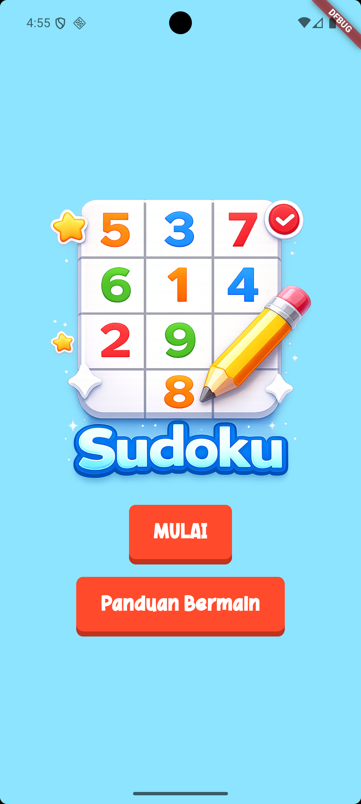
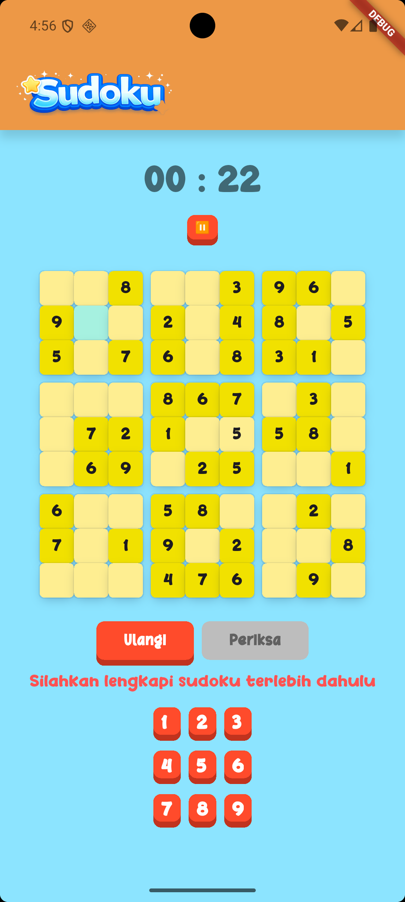

# Flutter Sudoku

A beautifully designed **Sudoku game built with Flutter** that combines logic, focus, and fun into a clean and engaging mobile experience. Solve puzzles, beat the timer, and enjoy a smooth custom UI designed from scratch.

---

## 🎯 Project Background

This project was created as part of my Flutter learning journey, developed over approximately **two weeks of focused practice and experimentation**. Instead of building small demo apps, the goal was to create a **real, playable Sudoku game** that resembles real-world application structure and behavior.

Rather than relying on templates or UI generators, every part of this game — from layout design, game flow, timer system, number pad, to win-state logic — was carefully crafted from scratch to better understand how production-like Flutter apps are built.

The main focus of this project includes:

* 🎨 UI/UX consistency
* 🧱 Clean and structured layout system
* 🎮 Interactive gameplay
* 🔄 State handling and lifecycle awareness
* 🧠 Game logic integration

Through this project, I aimed to go beyond theory and truly understand how Flutter widgets, state, and user interactions work together in a complete application.

---

## ✨ Features

* 🧩 Classic 9×9 Sudoku board
* ⏱ Real-time game timer
* ⏸ Pause & Resume functionality
* 🔢 Custom number pad (no system keyboard)
* 🎯 Cell selection & number input
* ✅ Answer validation
* 🏆 Win screen modal
* 🔁 Restart game option
* 🎨 Custom colorful UI & layout

---

## 📸 Screenshots

<p align="center">
  
  
  
</p>

---

## ⚙️ Technologies Used

| Category       | Technology                   |
| -------------- | ---------------------------- |
| Framework      | Flutter                      |
| Language       | Dart                         |
| UI System      | Material UI                  |
| State Handling | setState                     |
| Layout System  | Row, Column, GridView.       |
| Platform       | Android / iOS                |

---

## 🚀 Getting Started

### 🧰 Prerequisites

Make sure you have installed:

* [Flutter SDK](https://flutter.dev/docs/get-started/install)
* Android Studio / Xcode (for emulator)
* A physical device or emulator

---

### 📥 Clone the Repository

```bash
git clone <your-repository-url>
```

---

### 📦 Install Dependencies

```bash
flutter pub get
```

---

### ▶️ Run the App

```bash
flutter run
```

---

## 🧠 Learning Insights

This project helped me understand:

* How Flutter's **layout system** really works
* Managing UI state in an interactive app
* Building reusable widgets
* Handling user input without a keyboard
* Timer-based logic
* Designing game flow (start → play → win)

One of the biggest challenges was making the UI and the user's experience feel **game-like**, not like a standard form-based Flutter app.

---

## 🔮 Future Improvements (Optional)

* 🎚 Difficulty levels (Easy / Medium / Hard)
* 💾 Save progress
* 🏆 Best time leaderboard
* 🎵 Sound effects & animations

---

## 👤 Author

**I Gusti Agung Agastya Tarumawijaya**
[LinkedIn](https://www.linkedin.com/in/agunggst/) • [GitHub](https://github.com/agunggst)

---
